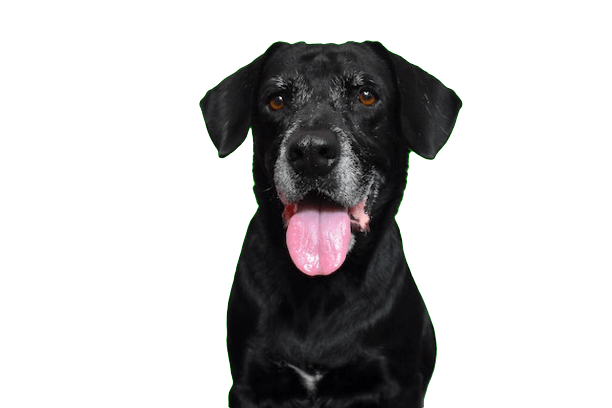
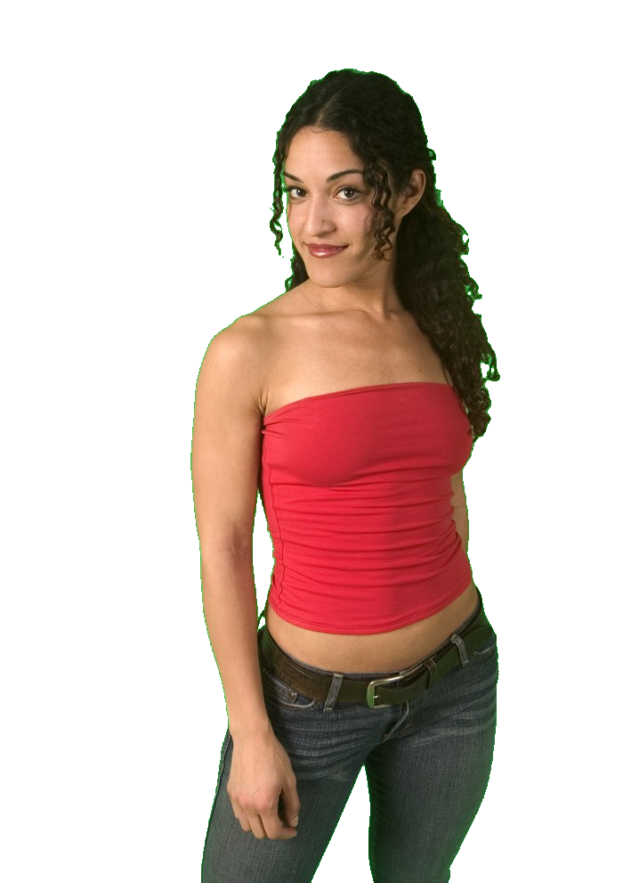

# Chroma

A fast, simple tool that removes colored backgrounds from images and gives you clean, smooth edges.

Chroma finds the background color on its own and makes it see-through. It uses a blur trick to make the edges look smooth instead of jagged.

```bash
./chroma -i ./example-images/ -v
```

## Requirements

- **libvips** - You need libvips installed on your system to run Chroma
- **Nim >= 2.0.0** - You need Nim 2.0.0 or newer to compile the code

## Performance

Benchmarks run on Arch Linux (AMD Ryzen 9 9950X, 92GB RAM) with 
libvips 8.17.3, averaged over 3 runs per size:

| Resolution | Megapixels | Total Time | Save Time | Processing Rate |
|------------|------------|------------|-----------|-----------------|
| 640x480 | 0.3 MP | ~10ms | ~1ms | ~30 images/sec |
| 1280x720 | 0.9 MP | ~11ms | ~2-3ms | ~90 images/sec |
| 1920x1080 | 2.1 MP | ~12ms | ~3-4ms | ~85 images/sec |
| 2560x1440 | 3.7 MP | ~13ms | ~5ms | ~75 images/sec |
| 3840x2160 (4K) | 8.3 MP | ~16ms | ~7-8ms | ~60 images/sec |
| 5120x2880 (5K) | 14.7 MP | ~19ms | ~11ms | ~50 images/sec |
| 6000x4000 | 24 MP | ~27ms | ~18ms | ~37 images/sec |
| 8000x6000 | 48 MP | ~39ms | ~30ms | ~26 images/sec |
| 10000x7500 | 75 MP | ~55ms | ~47ms | ~18 images/sec |

## Examples

| Before | After |
|--------|-------|
|  |  |
|  |  |
|  |  |
|  |  |

## How It Works

Chroma uses a library called libvips to edit images quickly without using too much memory.

## Memory Usage

libvips is smart about memory. It only does work when it really needs to. Here's how much memory it uses:
- **Starting up**: ~20-50MB just to get libvips ready
- **Each image**: The whole image needs to fit in memory while being worked on
- **Most memory used**: About 3-4 times the image size (for example, a 24MP photo is ~72MB, but may use ~200-300MB at peak)

Note: To find the background color, Chroma looks at 8 spots around the edges. This makes it load the whole image into memory. After that, the other steps (making the mask, blurring, fixing colors) are done together at the end when saving. This saves time and memory.

## Alternatives Comparison

See how Chroma compares to other tools that remove backgrounds.

| Original | Chroma | ImageMagick | ffmpeg |
|----------|--------|-------------|--------|
|  |  |  |  |
|  |  |  |  |
|  |  |  |  |
|  |  |  |  |

**Commands used:**
- **Chroma**: `./chroma -i image.jpg` (auto-detects background color)
- **ImageMagick**: `magick image.jpg -fuzz 15% -transparent "#RRGGBB" output.png`
- **ffmpeg**: `ffmpeg -i image.jpg -vf "chromakey=0xRRGGBB:0.15:0.1" output.png`
